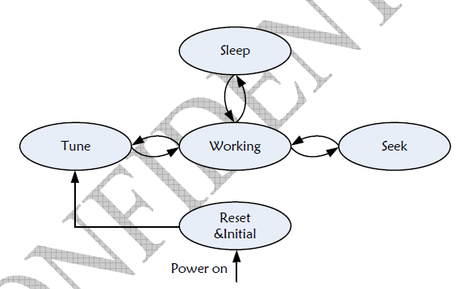

# RDA5807P Programming Guide V1.0

## 1. Description:
RDA5807P Provides two different software control modes: RDA5807P Mode and TEA5767 Mode.
In TEA5767 Mode, the control interface is I2C;
In RDA5807P Mode, the control interfaces are I2C and SPI, and set the high and low level on PIN7:MODE to select.

    MODE:0 ​​I2C; MODE ​​SPI

When the control interface is I2C, use CHIP ID to distinguish the working mode:

    TEA5767 MODE CHIP ID = 1100000B;
    RDA5807P MODE CHIP ID = 0010000B.

## TEA5767 Mode
1. I2C control interface

The I2C interface of TEA5767 MODE is compatible with I2C-Bus Specification 2.1 and includes 2 signals: SCLK and SDIO. The I2C interface is composed of START, command byte, data byte, ACK or NACK bit after each byte, and STOP. The command byte includes a 7-bit chip address (1100000b) and a read/write r/ command bit. ACK (or NACK) is sent by the receiver.

The address of the register in the I2C interface of TEA5767 MODE is not visible. The I2C interface of TEA5767 MODE transmits 5 bytes of data each time. Data structure: address, byte 1, byte 2, byte 3, byte 4, byte 5 (data must be transmitted in this order). During data transmission, each byte is transmitted MSB first. Address byte The last 1bit=0 indicates that the current operation is a write operation, otherwise it is a read operation.

When writing TEA5767 MODE, MCU writes the register, TEA5767 MODE will return an ACK after MCU writes each byte. MCU will give STOP to end the operation.
When reading the TEA5767 MODE, after the MCU gives the command byte, the TEA5767 MODE will send out the data byte, and the MCU will generate the ACK signal after receiving the data. Except for the last byte, the MCU will read every byte after reading Give ACK, after reading the last byte, MCU give NACK, make TEA5767 MODE hand over the bus to MCU, then MCU sends STOP, end the whole operation.

2. State transition

TEA5767 MODE has 5 states: reset initialization (Reset&Initial), set frequency (Tune), search (Seek), work (Working), and sleep (Sleep). The corresponding register can be configured in TEA5767 MODE.
After the chip is powered on and reset, the software can enter the power-on state by programming the STBY (04H, bit 6) register in TEA5767 MODE and setting STBY to 1. The software can make RDA5807P enter Tune or Seek state by programming the corresponding register. After these operations, RDA5807P enters the normal working state (Working). The software can make RDA5807P enter sleep state by setting STBY to 0, at this time all register values remain unchanged (the same as before sleep). In the sleep state, the software can return the RDA5807P to the working state by writing STBY as 1.
Figure

2.1 Reset initialization (Reset&Initial)

During the power-on process, TEA5767 MODE needs the correct Reset and initialization process to power-on.

## 5807P Mode
1. I2C interface mode

Connect the MODE pin to low level to enter the I2C interface mode.
The I2C interface in the 5807P Mode of RDA5807P is compatible with I2C-Bus Specification 2.1 and includes 2 signals: SCLK and SDIO. The I2C interface is composed of START, command byte, data byte, ACK or NACK bit after each byte, and STOP. The command byte includes a 7-bit chip address (0010000b) and a read and write r/w command bit. ACK (or NACK) is sent by the receiver.

The address of the register in the I2C interface of 5807P Mode is not visible. The I2C interface of RDA5807P Mode has a fixed starting register address (02H for write operations, 0AH for read operations), and an internal increment counter. When writing to RDA5807P Mode, the MCU writes the register sequence as follows: 02H high byte, 02H low byte, 03H high byte, ... until the end. RDA5807P Mode will return an ACK after each byte is written by the MCU. MCU will give STOP to end the operation. When reading RDA5807P Mode, after the MCU gives the command byte, RDA5807P Mode will send out data bytes in the following order: 0AH high byte, 0AH low byte, 0BH high byte, ... until RDA5807P Mode receives When the NACK is sent from the MCU, the MCU sends a STOP, and the read operation ends. Except for the last byte, MCU will give ACK after reading every byte. After reading the last byte, MCU will give NACK to make RDA5807P Mode hand over the bus to MCU, then MCU sends STOP to end the whole operation .

2. SPI 3-wire interface

Connect the MODE pin to a high level to enter the 3-wire interface mode.
Each register write operation requires a length of 25 bits, from high to low, including 4-bit register high address, 1-bit r/w, 4-bit register location address and 16-bit data (high-bit write first). RDA5807P Mode samples the command byte and data word on the rising edge of SCLK. Each register read operation also requires a 25-bit length, from high to low, including the 4-bit register high address, 1 bit r/, 4-bit register low address and 16-bit data (high bit read first). There is a half-SCLK gap between the MCU write command byte and the data read from RDA5807P Mode. RDA5807P Mode samples the command byte on the rising edge of SCLK and outputs data to the MCU on the rising edge of SCLK.

3. State transition

The 5807P Mode in RDA5807P has 5 states: Reset&Initial, Set Frequency (Tune), Search (Seek), Working (Working), Sleep (Sleep).
After the chip is powered on and reset, the software can make RDA5807P enter the power-on state by programming the ENABLE (02H, bit 0) register and setting it to 1. The software can make RDA5807P enter Tune or Seek state by programming the corresponding register. After these operations, RDA5807P enters the normal working state (Working). The software can make RDA5807P enter sleep state by setting ENABLE to 0, at this time all register values remain unchanged (the same as before sleep). In the sleep state, the software can return the RDA5807P to the working state by programming ENABLE as 1.

3.1 Reset initialization (Reset&Initial)

During power-on, 5807PMode in RDA5807P needs correct Reset and initialization process to power-on.

3.2 Set Frequency (Tune)

The software can select the FM channel by configuring the 03H register. Seek step length (100KHz, 200KHz, 50KHz or 12.5KHz) is selected by SPACE, channel is selected by CHAN[9:0], frequency range (76MHz_91MHz, 87MHz_108MHz, 76MHz_108MHz) is selected by BAND[1:0 ] To choose.

When the software writes the TUNE bit of the 03H register as 1, RDA5807P Mode will automatically start Tune. At the end of Tune (if STCIEN is set to 1, an interrupt signal INT will be sent by GPIO2), STC will be set to 1, and the software can read the 0AH and 0BH registers to get the current frequency status value (ST, FM_TRUE, FM_READY , RSSI, READCHAN, etc.). The entire Tune process lasts for 10ms, and it takes 20ms to determine the real channel and otherwise.

Refer to the conversion formula of register CHAN and READCHAN for frequency calculation method.

Programming pseudo program:

    Mov 0x1A10, 03H //Set channel number to 97.4MHz, space to 100KHz, band to 87_108MHz
    *Wait for GPIO2=0 //optional, wait for tune complete, if use interrupt
    *Wait for STC=1 //optional, wait for tune complete, if use polling method
    Read 0A, 0BH //read status
    Stop Tune
Note: For the I2C interface, the register settings of RDA5807P are completed by a series of write operations, so the software should pay attention to the order of writing registers. For the 3-wire interface, you only need to write the corresponding register.

4. Register description

Refer PDF

Attachment 1: I2C interface composite format

When the composite format i2c is used, the i2c chip address is 0010001b. The format is as follows:
